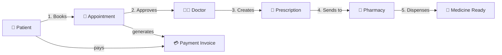
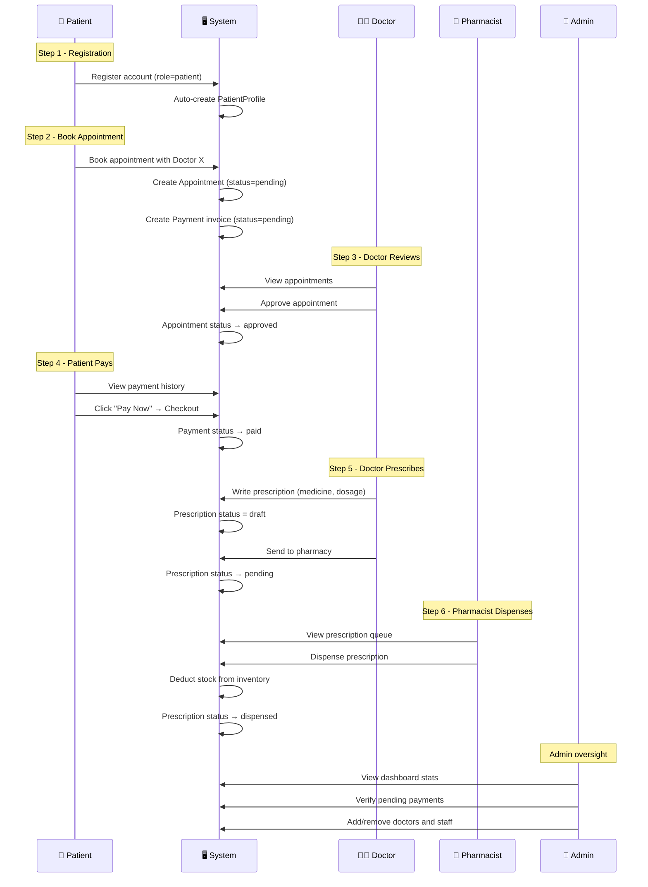

# 🏥 HMS — Complete Workflow Guide

This document explains **how everything works** in the Hospital Management System, step by step, for every role.

---

## 📊 System Overview — The Big Picture

---

## 👤 Role 1: Patient

### What can a patient do?

| Action | Where (URL) | How |
|--------|-------------|-----|
| Register | `/accounts/register/` | Fill the form, select role = Patient |
| Login | `/accounts/login/` | Email + password |
| View Profile | `/patients/profile/` | See personal info |
| Edit Profile | `/patients/profile/edit/` | Update phone, address |
| Book Appointment | `/patients/appointments/book/` | Pick a doctor + date/time |
| View Appointments | `/patients/appointments/` | See all booked appointments + statuses |
| Cancel Appointment | Click "Cancel" button | Only for `pending` appointments |
| View Payment History | `/patients/payments/` | See all invoices |
| Pay for Appointment | Click "Pay Now" | Only for `pending` payments |
| View Prescriptions | `/prescriptions/` | See medicines prescribed by doctor |

### Patient Flow (step by step):

1. **Register** → Profile is auto-created
2. **Login** → Redirected to Patient Portal
3. **Book Appointment** → Selects a doctor, picks a date/time → Appointment is created with status `pending` → A **Payment invoice** is automatically generated with status `pending`
4. **Wait for Doctor** → The doctor sees the appointment and either approves or cancels it
5. **Pay** → Go to Payment History → Click "Pay Now" → Complete checkout → Payment status becomes `paid`
6. **View Prescription** → After the doctor writes a prescription, the patient can see it in their Prescriptions page

> [!IMPORTANT]
> **The payment is for the appointment/consultation fee, NOT for medicine.** When a patient books an appointment, the system generates an invoice. The patient pays that invoice. Medicine dispensing by the pharmacy is a separate action.

---

## 👨‍⚕️ Role 2: Doctor

### What can a doctor do?

| Action | Where | How |
|--------|-------|-----|
| Login | `/accounts/login/` | Email + password |
| View Appointments | `/doctors/appointments/` | See all appointments assigned to them |
| Approve Appointment | Click "Approve" | Changes status from `pending` → `approved` |
| Cancel Appointment | Click "Cancel" | Changes status to `cancelled` |
| View Patient History | Click patient name | See all past appointments & prescriptions for that patient |
| Create Prescription | Click "Write Prescription" | Fill in medicine, dosage, instructions → Saved as `draft` |
| Send to Pharmacy | Click "Send to Pharmacy" | Changes prescription status from `draft` → `pending` |

### Doctor Flow (step by step):

1. **Login** → Redirected to Doctor Portal
2. **View Appointments** → See which patients booked with them
3. **Approve** the appointment → Status becomes `approved`
4. **Examine the patient** (happens in real life)
5. **Write Prescription** → Select the appointment → Enter medicine name, dosage, and instructions → Saved as `draft`
6. **Send to Pharmacy** → Prescription status changes to `pending` → Now the pharmacist can see it

---

## 💊 Role 3: Pharmacist

### What can a pharmacist do?

| Action | Where | How |
|--------|-------|-----|
| Login | `/accounts/login/` | Email + password |
| View Prescription Queue | `/prescriptions/` | See all prescriptions with status `pending` |
| Dispense Prescription | Click "Dispense" | Marks prescription as `dispensed` + deducts stock |
| View Inventory | `/pharmacists/inventory/` | See all medicines in stock |
| Update Inventory | Add/Edit inventory items | Change stock quantities |
| Low Stock Alerts | Inventory page | Items with low stock are highlighted |

### Pharmacist Flow (step by step):

1. **Login** → Redirected to Pharmacist Portal
2. **Check Prescription Queue** → See prescriptions that doctors sent (status = `pending`)
3. **Dispense** → Click dispense on a prescription → Stock is deducted from inventory → Prescription status becomes `dispensed`
4. **Manage Inventory** → Add new medicines, update stock levels

> [!NOTE]
> **How does the pharmacist know the patient paid?** In the current system, the payment is for the **consultation/appointment fee** — it's between the patient and the hospital. The pharmacist dispenses based on the **doctor's prescription**, not the payment status. The doctor sends the prescription to the pharmacy, and the pharmacist fulfills it. This is how most hospital systems work — medicine dispensing is part of the hospital service, not a separate purchase.

---

## 🔧 Role 4: Admin

### What can an admin do?

| Action | Where (URL) | How |
|--------|-------------|-----|
| Login | `/accounts/login/` | Email + password |
| View Dashboard | `/dashboard/` | See stats: patients, doctors, appointments, payments, prescriptions |
| **Add Doctor** | `/dashboard/doctors/add/` | Fill form with email, name, password |
| **Delete Doctor** | `/dashboard/doctors/delete/<id>/` | Confirm deletion (see below ⬇️) |
| **Add Staff** | `/dashboard/staff/add/` | Fill form with email, name, password, role |
| **Delete Staff** | `/dashboard/staff/delete/<id>/` | Confirm deletion (see below ⬇️) |
| Verify Payments | `/dashboard/payments/verify/` | Bulk-approve all pending payments |
| View Payment Ledger | `/payments/` | See all payments across the system |

### ⚠️ Where Does Admin Delete Staff and Doctors?

> [!IMPORTANT]
> The **delete functionality already exists** in the code at these URLs:
> - Delete staff: `/dashboard/staff/delete/<user_id>/`
> - Delete doctor: `/dashboard/doctors/delete/<doctor_user_id>/`
> 
> **However**, there is currently **no list page** in the dashboard where the admin can see all staff/doctors and click a delete button. The admin can only reach these URLs if they know the user ID.
> 
> **To fix this**, we need to create two new pages:
> 1. **Staff List** — shows all staff members with a "Delete" button next to each
> 2. **Doctor List** — shows all doctors with a "Delete" button next to each
> 
> **Do you want me to create these list pages?** This would add sidebar links like "Manage Doctors" and "Manage Staff" where the admin can view and delete users.

---

## 🔄 Complete End-to-End Flow

Here is the complete lifecycle of a hospital visit in the system:

---

## 📋 Status Cheat Sheet

### Appointment Statuses
| Status | Meaning | Who Changes It |
|--------|---------|---------------|
| `pending` | Patient booked, waiting for doctor | Auto (on booking) |
| `approved` | Doctor approved the appointment | Doctor |
| `cancelled` | Either patient or doctor cancelled | Patient or Doctor |

### Payment Statuses
| Status | Meaning | Who Changes It |
|--------|---------|---------------|
| `pending` | Invoice created, not paid yet | Auto (on booking) |
| `paid` | Patient completed checkout | Patient or Admin (bulk verify) |
| `refunded` | Money returned | Admin |

### Prescription Statuses
| Status | Meaning | Who Changes It |
|--------|---------|---------------|
| `draft` | Doctor just wrote it, not sent yet | Auto (on creation) |
| `pending` | Sent to pharmacy, waiting to be dispensed | Doctor |
| `dispensed` | Pharmacist gave the medicine | Pharmacist |

---

## 🤔 Common Questions Answered

**Q: Does the patient pay for medicine separately?**
A: No. In this system, the payment is for the **consultation/appointment fee**. Medicine is dispensed as part of the hospital service based on the doctor's prescription.

**Q: How does the pharmacy know to give medicine to a patient?**
A: The doctor writes a prescription and clicks "Send to Pharmacy." This changes the prescription status to `pending`. The pharmacist sees it in their Prescription Queue and dispenses it.

**Q: Can a patient cancel a paid appointment?**
A: A patient can only cancel `pending` appointments. Once the appointment is `approved` by the doctor, the cancel button is no longer available.

**Q: What does "Verify Payments" do?**
A: This is an admin bulk action that marks ALL `pending` payments as `paid`. This is useful if the hospital processes payments offline and wants to update the system records.
